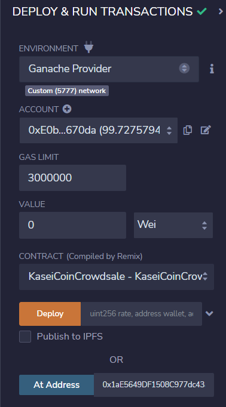
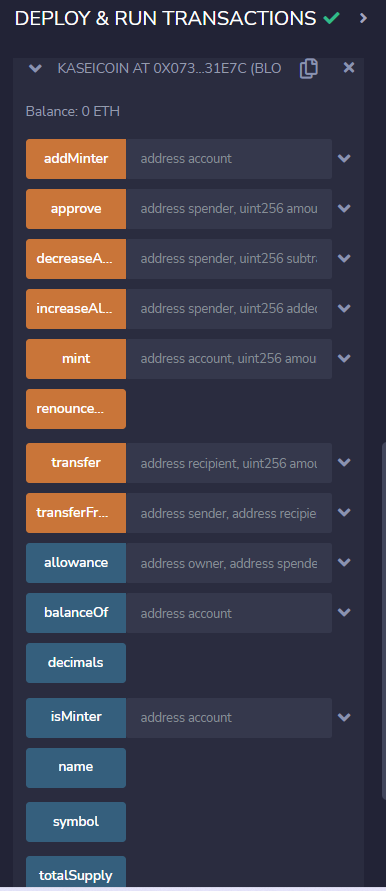
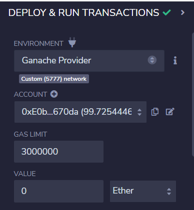

# Martian-Token-Crowdsale

## Background
After waiting for years and passing several tests, the Martian Aerospace Agency selected me to become part of the first human colony on Mars. As a prominent fintech professional, they chose me to lead a project developing a monetary system for the new Mars colony. I decided to base this new system on blockchain technology and to define a new cryptocurrency named KaseiCoin. (Kasei means Mars in Japanese.)

KaseiCoin will be a fungible token that’s ERC-20 compliant. I have launched a crowdsale that will allow people who are moving to Mars to convert their earthling money to KaseiCoin.

## Step 1: Create the KaseiCoin Token Contract
Firstly, I have created a smart contract that defines KaseiCoin as an ERC-20 token. To do so, I have completed the following steps:

1. Import the following contracts from the OpenZeppelin library:

    * `ERC20`

    * `ERC20Detailed`

    * `ERC20Mintable`

2. Define a contract for the KaseiCoin token, and name it `KaseiCoin`. Have the contract inherit the three contracts that I just imported from OpenZeppelin.

3. Inside my `KaseiCoin` contract, add a constructor with the following parameters: `name`, `symbol`, and `initial_supply`.

4. As part of my constructor definition, add a call to the constructor of the `ERC20Detailed` contract, passing the parameters `name`, `symbol`, and `18`. (Recall that 18 is the value for the `decimals` parameter.)

## Step 2: Create the KaseiCoin Crowdsale Contract
In this subsection, you’ll define the KaseiCoin crowdsale contract. To do so, I have completed the following steps:

1. Have this contract inherit the following OpenZeppelin contracts:

    * `Crowdsale`

    * `MintedCrowdsale`

2. In the `KaisenCoinCrowdsale` constructor, provide parameters for all the features of my crowdsale, such as `rate`, `wallet` (where to deposit the funds that the token raises), and `token`. Configure these parameters as I want for my KaseiCoin token.

### Step 3: Create the KaseiCoin Deployer Contract

I have created the KaseiCoin deployer contract. In the `KaseiCoinCrowdsaleDeployer` contract, I have added variables to store the addresses of the `KaseiCoin` and `KaseiCoinCrowdsale` contracts, which this contract will deploy. Finally, I have completed the `KaseiCoinCrowdsaleDeployer` contract. To do so, I have completed the following steps:

1. Create an `address public` variable named `kasei_token_address`, which will store the `KaseiCoin` address once that contract has been deployed.

2. Create an `address public` variable named `kasei_crowdsale_address`, which will store the `KaseiCoinCrowdsale` address once that contract has been deployed.

3. Add the following parameters to the constructor for the `KaseiCoinCrowdsaleDeployer` contract: `name`, `symbol`, and `wallet`.

4. Inside of the constructor body (that is, between the braces), I have completed the following steps:

    * Create a new instance of the `KaseiCoinToken` contract.

    * Assign the address of the KaseiCoin token contract to the `kasei_token_address` variable. (This will allow me to easily fetch the token's address later.)

    * Create a new instance of the `KaseiCoinCrowdsale` contract by using the following parameters:

      * The `rate` parameter: Set `rate` equal to 1 to maintain parity with ether.

      * The `wallet` parameter: Pass in `wallet` from the main constructor. This is the wallet that will get paid all the ether that the crowdsale contract raises.

      * The `token` parameter: Make this the `token` variable where `KaseiCoin` is stored.

    * Assign the address of the KaseiCoin crowdsale contract to the `kasei_crowdsale_address` variable. (This will allow you to easily fetch the crowdsale’s address later.)

    * Set the `KaseiCoinCrowdsale` contract as a minter.

    * Have the `KaseiCoinCrowdsaleDeployer` renounce its minter role.

## Step 4: Compile and Deploy the Crowdsale on a Local Blockchain(Evaluation Evidence)
First I have compiled the `KaseiCoin Token` contract by using compiler version 0.5.5.

I have compiled the `KaseiCoin Crowdsale` contract by using compiler version 0.5.5.

I have also compiled the `KaseiCoin Deployer` contract by using compiler version 0.5.5.

Next, I deployed the `KaseiCoin Deployer` contract.

I then opened the deployed `KaseiCoin Deployer` contract, here you can see the two addresses for the `KaseiCoin Crowdsale` and the `KaseiCoin Token` contract.

As the contracts have been deployed, I used the `At Address` function to interact with the `KaseiCoin Crowdsale` and the `KaseiCoin Token` contract.

These are the functions in the `KaseiCoin Crowdsale` contract:

These are the functions in the `KaseiCoin Token` contract:

## Step 5: Test the Crowdsale on a Local Blockchain
To test the functionality of the crowdsale until this step, I used some test accounts to buy new tokens and then checking the balances of those accounts.

Up to this step, because we have not finalised the crowdsale, hence only the gas fee was deducted from the account. We can see the account balance has dropped slightly:

The `weiRaised` is 3000000000000000000, which matches with the 3 ETH worth of KAI I tried to buy:

The `totalSupply` and the `balanceOf` both show 3000000000000000000 as well:

And this transaction can be varified in Ganache:

## Extend the Crowdsale Contract by Using OpenZeppelin
On top of the basic crowdsale contract above, I have extended the crowdsale contract to enhance its functionality. To do so, I have used the following OpenZeppelin contracts:

* The `CappedCrowdsale` contract: Allows me to cap the total amount of ether that my crowdsale can raise.

* The `TimedCrowdsale` contract: Allows me to set a time limit for my crowdsale by adding an opening time and a closing time.

* The `RefundablePostDeliveryCrowdsale` contract: Allows me to refund my investors. Every time that I launch a crowdsale, I set a goal amount of ether to raise. If I don’t reach the goal, it’s a common practice to refund my investors.
