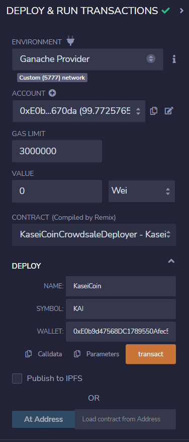

# Martian-Token-Crowdsale

## Background
After waiting for years and passing several tests, the Martian Aerospace Agency selected me to become part of the first human colony on Mars. As a prominent fintech professional, they chose me to lead a project developing a monetary system for the new Mars colony. I decided to base this new system on blockchain technology and to define a new cryptocurrency named KaseiCoin. (Kasei means Mars in Japanese.)

KaseiCoin will be a fungible token that’s ERC-20 compliant. I have launched a crowdsale that will allow people who are moving to Mars to convert their earthling money to KaseiCoin.

## Compile and Deploy the Smart Contract
First I have compiled the `KaseiCoin Token` contract.

I have compiled the `KaseiCoin Crowdsale` contract.

I have also compiled the `KaseiCoin Deployer` contract.

Next, I deployed the `KaseiCoin Deployer` contract.

I then opened the deployed `KaseiCoin Deployer` contract, here you can see the two addresses for the `KaseiCoin Crowdsale` and the `KaseiCoin Token` contract.

As the contracts have been deployed, I used the `At Address` function to interact with the `KaseiCoin Crowdsale` and the `KaseiCoin Token` contract.

This is the functions in 

## Interact with The Deployed Smart Contract

## Evaluation Evidence